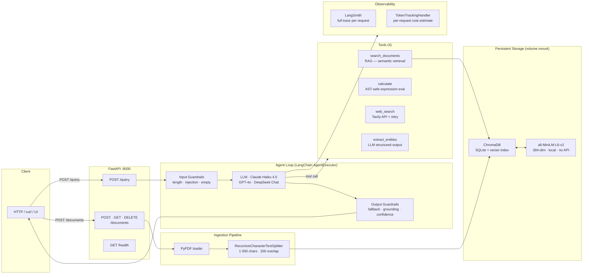

# Document Intelligence Agent


A production-grade document intelligence system that lets you query a library of PDF documents in natural language. Drop in a folder of contracts, reports, or invoices — then ask questions, run calculations, and extract structured data through a REST API powered by a multi-tool LLM agent.

Built to demonstrate what production AI systems look like in practice: not just a chatbot wrapper, but a system with guardrails, observability, multi-model evaluation, and a clean operational interface.

---

## Demo

> **Add your screenshots and/or GIF here.**
>
> Suggested captures:
> 1. `http://localhost:8000/docs` — Swagger UI with a POST /query response expanded
> 2. Terminal GIF of the REPL: `python query.py` asking a few follow-up questions
>
> Tools: [Kap](https://getkap.co) (macOS), [asciinema](https://asciinema.org), or [LICEcap](https://www.cockos.com/licecap/)

---

## Architecture



**Flow for a query:**
1. `POST /query` → input guardrails (length, injection, empty)
2. LLM decides which tool(s) to call, up to 6 iterations
3. Tools execute: RAG search, safe arithmetic, live web, or entity extraction
4. Output guardrails: fallback on failure, grounding check, confidence flag
5. Response includes answer, retrieved snippets, token count, and cost estimate

---

## Features

| Category | What's built |
|---|---|
| **Agent** | 4-tool ReAct agent — document RAG, safe calculator, web search, entity extraction |
| **Guardrails** | 6-stage cascade: input validation → error handling → fallback → low-confidence detection → grounding heuristic → structured response |
| **Multi-model** | Claude Haiku 4.5, GPT-4o, DeepSeek Chat — same tools and prompt, swappable at request time |
| **Observability** | LangSmith tracing (every tool call, latency, token count) + in-process cost estimation |
| **Evaluation** | 20-case automated eval: tool routing accuracy + content accuracy scored across models |
| **Testing** | 89 tests across 6 files — unit (calculator, chunker, token tracker) + integration (guardrails, orchestration) |
| **API** | FastAPI REST API with Swagger UI, typed request/response models |
| **Operations** | Docker + docker-compose, env-var configurable paths, `manage.py` CLI for document management |

---

## Tech Stack

| Layer | Technology |
|---|---|
| LLM providers | Anthropic Claude, OpenAI GPT-4o, DeepSeek (via OpenAI-compatible API) |
| Agent framework | LangChain (`create_tool_calling_agent` + `AgentExecutor`) |
| Vector store | ChromaDB (local, file-persisted) |
| Embeddings | `all-MiniLM-L6-v2` via sentence-transformers — 384-dim, runs locally, no API key |
| PDF parsing | PyPDF |
| Web search | Tavily API |
| API server | FastAPI + Uvicorn |
| Tracing | LangSmith |
| Testing | pytest |
| Package management | uv |
| Containerization | Docker + docker-compose |

---

## Quick Start

**Three commands to run everything:**

```bash
git clone https://github.com/YOUR_USERNAME/document-intelligence-agent
cp .env.example .env          # add your ANTHROPIC_API_KEY (minimum)
docker compose up --build
```

The API starts at `http://localhost:8000`. Open `http://localhost:8000/docs` for the interactive Swagger UI.

> **First run:** Docker builds the embedding model into the image (~80 MB), so the initial `docker build` takes 2–3 minutes. Subsequent starts are instant.

**Add your documents:**

```bash
# Drop PDFs into data/documents/ before starting — they are auto-ingested at startup
cp your_contracts/*.pdf data/documents/
docker compose up --build

# Or upload at runtime via the API (no restart needed)
curl -X POST http://localhost:8000/documents -F "file=@contract_2024.pdf"
```

---

## API Reference

### `GET /health`
System status — ChromaDB reachability, loaded document count, available models.

```bash
curl http://localhost:8000/health
# {"status":"ok","documents_loaded":847,"models_available":["haiku"]}
```

### `GET /documents`
List all ingested documents with chunk counts.

```bash
curl http://localhost:8000/documents
# {"documents":{"contract_2024.pdf":42,"invoice_march.pdf":18},"total_chunks":60}
```

### `POST /documents`
Upload and ingest a PDF. Re-uploading an existing filename replaces it (idempotent).

```bash
curl -X POST http://localhost:8000/documents \
  -F "file=@contract_2024.pdf"
# {"filename":"contract_2024.pdf","chunks_added":42,"total_chunks":102}
```

### `DELETE /documents/{filename}`
Remove all chunks for a specific document.

```bash
curl -X DELETE http://localhost:8000/documents/contract_2024.pdf
# {"filename":"contract_2024.pdf","chunks_removed":42,"total_chunks":60}
```

### `DELETE /documents`
Remove all documents and wipe the vector store entirely.

```bash
curl -X DELETE http://localhost:8000/documents
# {"documents_removed":5,"chunks_removed":312}
```

### `POST /query`
Query the agent. The `model` field is optional (defaults to `"haiku"`).

```bash
curl -X POST http://localhost:8000/query \
  -H "Content-Type: application/json" \
  -d '{"query": "What are the payment terms in the service agreement?"}'
```

```json
{
  "answer": "The service agreement specifies net-30 payment terms...",
  "success": true,
  "warning": null,
  "snippets": ["[1] Source: service_agreement.pdf, Page: 3\nPayment is due..."],
  "latency_s": 3.2,
  "tokens": 4821,
  "cost_usd": 0.000042
}
```

**Request body:**
```json
{
  "query": "string",
  "model": "haiku | gpt4o | deepseek"
}
```

Full interactive docs at `http://localhost:8000/docs`.

---

## Local Development

**Prerequisites:** Python 3.13+, [uv](https://docs.astral.sh/uv/)

```bash
# Install dependencies
uv sync

# Set up API keys
cp .env.example .env   # fill in at minimum ANTHROPIC_API_KEY

# Ingest documents
uv run python manage.py add data/documents/

# Start the API
uv run uvicorn src.api.app:app --reload

# Or use the interactive CLI
uv run python query.py

# Run tests
uv run pytest tests/ -v

# Run evaluation (requires documents ingested)
uv run python eval/run_eval.py --models haiku
```

**Document management CLI:**

```bash
uv run python manage.py list                          # show all documents
uv run python manage.py add data/documents/report.pdf # ingest a PDF
uv run python manage.py add data/documents/           # ingest a directory
uv run python manage.py remove report.pdf             # remove by filename
```

---

## Evaluation Results

Automated evaluation across 20 test queries in three categories: tool routing (does the agent call the right tool?), answer quality (does the answer contain the expected content?), and edge cases.

| Metric | Claude Haiku 4.5 | DeepSeek Chat |
|---|---|---|
| Tool Routing Accuracy | **100%** (20/20) | **100%** (20/20) |
| Content Accuracy | **100%** (20/20) | **100%** (20/20) |
| Avg Latency | **4.8 s** | 18.8 s |
| Total Tokens (20 queries) | 89,551 | 122,817 |
| Est. Cost (20 queries) | **$0.09** | $0.04 |
| Failures (success=False) | **0** | 5 |

*GPT-4o excluded from this run due to API quota. DeepSeek failures are agentic loop timeouts on complex multi-step queries, not incorrect answers — routing and content scores remain perfect.*

Evaluation script: `eval/run_eval.py`. Results are saved as CSV to `eval_results/`.

---

## Project Structure

```
.
├── src/
│   ├── agent/
│   │   ├── agent.py          # build_agent(), query_agent() — orchestration + guardrails
│   │   └── tools.py          # 4 LangChain tools: search, calculate, web, entities
│   ├── api/
│   │   ├── app.py            # FastAPI app — routes, lifespan, startup
│   │   └── models.py         # Pydantic request/response schemas
│   ├── ingestion/
│   │   ├── loader.py         # PDF loading (PyPDF)
│   │   └── chunker.py        # RecursiveCharacterTextSplitter wrapper
│   ├── observability/
│   │   └── token_tracker.py  # LangChain callback — token counting + cost estimation
│   ├── vectorstore/
│   │   └── chroma_store.py   # ChromaDB wrapper with HuggingFace embeddings
│   └── config.py             # Single source of truth for all constants
├── eval/
│   ├── run_eval.py           # Multi-model evaluation runner
│   └── test_cases.py         # 20 Q&A test pairs across 3 categories
├── tests/                    # 89 tests: unit + integration
├── examples/
│   ├── RAG_demo.py           # Phase 1: ingestion pipeline walkthrough
│   └── agent_demo.py         # Phase 2: tool-calling agent demo
├── data/
│   ├── documents/            # Drop PDFs here (or use manage.py / POST /documents)
│   └── chroma_db/            # ChromaDB persisted storage (auto-created)
├── manage.py                 # Document management CLI
├── query.py                  # CLI query interface + interactive REPL
├── Dockerfile
└── docker-compose.yml
```

---

## What I'd Improve with More Time

**1. Streaming responses**
The current API blocks until the agent loop finishes (2–15s depending on tool use). Server-Sent Events would stream tokens as they arrive, making the interface feel instant. FastAPI supports this natively with `StreamingResponse`.

**2. Conversation memory**
Every query is stateless — follow-up questions ("who signed it?") have no context. Adding a `{chat_history}` placeholder to the prompt and accumulating `HumanMessage`/`AIMessage` pairs across turns is ~20 lines of code with significant UX impact.

**3. Async agent execution**
`query_agent()` is synchronous and blocks the FastAPI event loop. Wrapping it in `asyncio.to_thread()` would allow genuinely concurrent requests without a separate worker pool. At current scale this isn't a bottleneck, but it would be before horizontal scaling.

**4. Richer document ingestion**
Current pipeline: text extraction from PDFs only. Production enterprise documents also need: table parsing ([camelot](https://camelot-py.readthedocs.io/)), scanned doc OCR ([Tesseract/surya](https://github.com/VikParuchuri/surya)), Word/Excel support, and metadata extraction (author, creation date, document classification).

**5. Metadata-aware retrieval**
ChromaDB supports filter queries (e.g., search only within a specific document or date range). Exposing `filter_by_source` and `filter_by_date` parameters in `POST /query` would let users scope questions to a specific contract or report without needing to unload other documents.

**6. Cloud vector store for scale**
ChromaDB embedded means single-instance only. For multi-tenant or high-availability deployment, migrating to Pinecone, Weaviate, or pgvector would enable horizontal scaling and per-user document isolation without code changes in the agent layer.

---

## Built with Claude Code

This project was built AI-natively using [Claude Code](https://claude.ai/claude-code) as the primary development environment — not as an autocomplete tool, but as an active collaborator for architecture decisions, debugging, writing tests, and iterating on design.

The workflow that made this possible in days rather than weeks:
- Spec a phase → implement → run tests → review results → refine in tight loops
- Use Claude Code to write and immediately validate regression tests when bugs are found
- Let the AI handle boilerplate (retry decorators, Pydantic schemas, Dockerfile) while focusing on architectural decisions
- Eval-driven iteration: run `eval/run_eval.py`, identify failures, trace root cause in LangSmith, fix, re-eval

This is the workflow I bring to any AI engineering project.

---

## License

MIT

---

*Questions or feedback? Open an issue or reach out on [LinkedIn](https://linkedin.com/in/YOUR_PROFILE) · [GitHub](https://github.com/YOUR_USERNAME)*
